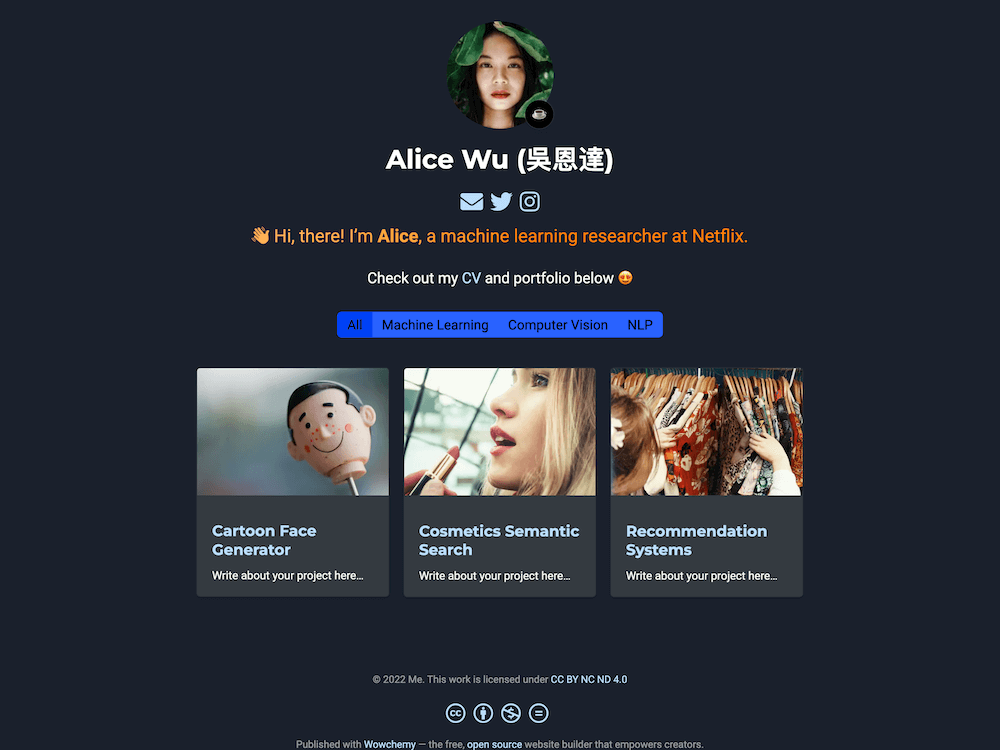

#  Samuel Oyewusi — Data Science Portfolio

Welcome to my **Data Science Portfolio** — a showcase of my work in **data analytics**, **machine learning**, and **computer vision**.  
Built with [Hugo Blox Builder](https://hugoblox.com) and deployed via GitHub Pages 🚀.

---

## 🧩 About Me

I’m **Samuel Oyewusi**, a Data Analyst and aspiring Machine Learning Engineer passionate about transforming raw data into actionable insights.

My expertise covers:
- 📊 **Data Analysis & Visualization** — Power BI, SQL, and Python (Pandas, Matplotlib, Seaborn)
- 🤖 **Machine Learning** — Scikit-learn, TensorFlow, regression/classification projects
- 👁️ **Computer Vision** — OpenCV and deep learning-based visual tasks
- ⚙️ **Logistics Data Analytics** — experience with supply chain and operations data

---

## 📁 Portfolio Sections

You can explore my projects by category:

| Category | Description |
|-----------|--------------|
| **Analytics** | Exploratory data analysis, KPI dashboards, business insights |
| **Machine Learning** | Predictive modeling, supervised & unsupervised learning |
| **Computer Vision** | Image recognition, object detection, OCR |
| **Backend & APIs** | Data pipelines and model deployment using FastAPI |

---

## 🧰 Tech Stack

**Languages:** Python, SQL  
**Libraries:** Pandas, NumPy, Matplotlib, Scikit-learn, OpenCV, TensorFlow  
**Tools:** Power BI, Excel, VS Code, Git, GitHub Actions  
**Deployment:** Hugo Blox Builder + GitHub Pages  

---

## 🚀 How to View

You can view the live site here:  
👉 **[Visit My Portfolio](https://https://suntwister.github.io/)**

